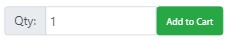

# Django Project - Primary School Books

Primary School Books is ecommerce website created to sell primary school books online.
The main idea of selling primary school books online is to reduce back to school pressure that all parents feel every year.
Buying online can reduce time and energy spend on travel to book stores. Also online purchases can be done at any convenient for customer time and place. 

## Contents
1.[ UX ](#ux)

* [User story](#user-story)
* [ Wireframes ](#wireframes)  
* [ Features ](#features)

  * [Existing Features](#existing-features)  
  * [Features Left To Implement](#features-left-to-implement)  

2.[ Technology Used ](#technology-used)

* [Front-End Technologies](#front-end-technologies)
* [Back-End Technologies ](#back-end-technologies)

3.[ Testing ](#testing)  
4.[ Development ](#development)  
5.[ Deployment ](#deployment)  

* [Deployment to Heroku](#deployment-to-heroku)  
* [Host static files to AWS S3](#host-static-files-to-aws-s3)

6.[ Credit ](#credit)  

* [Content](#content)  
* [Code](#code)  
* [Images](#images)  
* [Acknowledgement](#acknowledgement)

## UX

### **User story**  
As a user, I would like to:  
* View the site from any device  
* View and search the site as a guest
* Search for books by title, class and subject
* View information about a book
* Register, login and logout
* Change my password
* Add books to my shopping cart
* View my shopping cart
* Purchase items in my shopping cart
* Contact site owner
* Create my profile and update it

### **Wireframes**
Wireframes are created in **Balsamiq**.

Checkout wireframes for [desktop](static/wireframes/desktop) and [mobile devices](static/wireframes/mobile)

### **Features**

#### Existing Features
* Login/registration
  * User sign in - allows user to sign in and create book lists and save books.
  * User sign up - allows user to register.
  * User sign out - sign out user.

* Flash messaging - allowing to see how successful was a certain action.
* Pagination
* Search for books by name, class and subject
* Add item to shopping cart
* View shopping cart
* Puchase items using credit card

#### Features Left To Implement
* user's profile
* footer
* fonts
* Password reset and sending real emails.  
'Sending real email' feature doesn't work possibly due to strong Google security.


[back to top](#contents)

## Technology Used

* gitpod (an online IDE which can be launched from any GitHub page)
* GitHub (for software development version control using Git)
* Balsamiq

### **Front-End Technologies**
* HTML5 (the standard markup language for Web pages.)
* CSS3 (a language that describes the style of an HTML document)
* JQuery (a JavaScript Library)
* Bootstrap 4 (a css framework)
* Stripe API (used for secure online payments using credit card)
* Amazon AWS S3 (allows to store images and static files in a Cloud)

### **Back-End Technologies**
* Python 3.7.7 (a programming language used to create the backend)
* Django 1.11.29 (a Python web framework)
* Heroku (service for hosting app)
* Heroku PostgresSQL (Heroku SQL database)

[back to top](#contents)

## Testing

I carried out manual tests to check that all features work as expected.

| Test               | Input              | Expected Output    |Pass    |  
| --------------     | ----------------- | ------------------- | :--------:|
| ***Navigation Bar Links*** |
| | Click on Logo | Should open landing products.html page | *Yes* |
| | Click "Home" link | Should open landing products.html page | *Yes* |  
| | Click "Primary Books" link | Should open dropdown mega-menu with a list of subject for each class | *Yes* |  
| | Click "Contact Us" link | Should open contact form | *Yes* |
| | Click "Login" link | Should open login page  |  *Yes* |
| | Click "Register" link | Should open registration page | *Yes* |
| | Click "Logout" link | Should logout user, redirect to landing page and display "You have been logged out" message | *Yes* |
| | Click "Profile" link | Should open profile page | *No* |
| |  Enter word query into search bar | Should open search_results page and display found items or "No books found" message | *Yes* |
| | Click "Cart" word or icon| Should open cart page | *Yes* |
| |  Click "search" icon | Should toggle a search bar on small mobile devices  | *Yes* |
| ***Dropdown mega-menu*** |  Click on any subject link | Should open search_by_class_subject page and display books for this class and subject or "No books found" message  | *Yes* |
| ***Login Form*** | <ol><li>Fill in details for registered account</li><li>Submit an empty form</li><li>Submit an incomplete form</li><li>Submit form with unregistered details</li><li>Submit form with wrong, password, username or email </li><li>Click "Reset password" link</li></ol> | <ol><li>Should open landing page and "You have successfully logged in!" django-message will appear</li><li>Should stay on the same page and show "Fill in this field" message</li><li>Should stay on the same page and show "Fill in this field" message</li><li>Should show "Your username or password is incorrect" django message </li><li>Should show "Your username or password is incorrect" django message </li><li>Should open Reset Password page</li></ol> | <ol><li>*Yes*</li><li>*Yes*</li><li>*Yes*</li><li>*Yes*</li><li>*Yes*</li><li>*Yes*</li></ol>
| ***Registration Form*** | <ol><li>Submit an empty form</li><li>Submit an incomplete form</li><li>Fill in all the required fields and submit form </li></ol> | <ol></li><li>Should stay on the same page and show "Fill in this field" message</li><li>Should stay on the same page and show "Fill in this field" message</li><li>Should open landing page and "You have successfully registered" django-message will appear</li></ol> | <ol><li>*Yes*</li><li>*Yes*</li><li>*Yes*</li></ol>
| ***Contact Form*** | <ol><li>Submit an empty form</li><li>Leave out any of required fields and submit form</li><li>Fill in form and submit</li></ol> | <ol><li>Should show "This field is required" message under the required fields</li><li>Should show "This field is required" message under the required fields</li><li>Should show "Your message was submitted successfully. Thank you" message</li></ol> | <ol><li> *Yes*</li><li> *Yes*</li><li> *Yes*</li></ol>
| ***Products*** |
| | Click on book image or title  | Should open product-info.html page | *Yes* |
| | Click on "Add to cart" button | Should add item to the shopping cart.  | *Yes* |
|

* Testing write up isn't complete due to insufficient time.

[back to top](#contents)

## Development
This project was created from Code Istitute's Gitpod Full Template.
The code was edited in Gitpod.

#### To set up project:  
1) Install Gjango:
```  
pip3 install django==1.11.28
```  

2) Create project:  
```
django-admin startproject estore .
```  

3) Create App:
```
django-admin startapp app_name
```

4) Apply migrations:
```  
python3 manage.py migrate
``` 
5) Create superuser:
```
python3 manage.py createsuperuser
``` 

6) Create environment variables:
```  
os.environ['SECRET_KEY'] = 'secret key string'
```  

#### To run application in browser:
```
python3 manage.py runserver
```

#### Add Bootstrap styling to the forms:
```
pip3 install django_forms_bootstrap
```
#### Install Pillow:
```
pip3 install Pillow
```
#### Set up Stripe:

Install Stripe:
```
pip3 install stripe
```
Create environment variables:
```  
os.environ.setdefault('STRIPE_PUBLISHABLE', 'Publishable key from stripe.com') 
os.environ.setdefault('STRIPE_SECRET', 'Secret key from stripe.com')
```

#### Add AWS S3 to Django

```
pip3 install django-storages
```
```
pip3 install boto3
```
Create environment variables:
```  
os.environ.setdefault('AWS_ACCESS_KEY_ID', 'AWS Access Key ID')
os.environ.setdefault('AWS_SECRET_ACCESS_KEY', 'AWS Secret Access Key')
```

[back to top](#contents)

## Deployment

This project can be viewed live on Heroku: https://django-pr0ject.herokuapp.com/

### **Deployment to Heroku**

1. Create new Heroku App on www.heroku.com

2. Connect to Heroku Postgres:

Connect to database url:
```
pip3 install dj-database-url
``` 
Connect to Postgres database:
```
pip3 install psycopg2
``` 
Create environment variables:
```  
os.environ.setdefault('DATABASE_URL','Database URL from Heroku dashboard settings')
```  
3. In Settings set Config Vars: 

* DATABASE_URL
* SECRET_KEY
* AWS_ACCESS_KEY_ID
* AWS_SECRET_ACCESS_KEY
* STRIPE_PUBLISHABLE
* STRIPE_SECRET
* DISABLE_COLLECTSTATIC
* EMAIL
* PASSWORD

4. Create a *Procfile*

5. Connect to Heroku

```
pip3 install gunicorn
```
6. Add Heroku app to allowed hosts in settings.py

7. On Heroku in **Deploy** section connect to GitHub 

8. In **Deploy** section(*Manual deploy*) to deploy a GitHub branch click 'Deploy branch'.

### **Host static files to AWS S3**

* register for free **AWS** account
* In **AWS S3** create a bucket with unique name
* In bucket **Settings** choose *allow public access* to allow access to static files by our website.
* In **Permissions** tab set *CORS configuration*
```
<CORSConfiguration>
<CORSRule>
<AllowedOrigin>*</AllowedOrigin>
<AllowedMethod>GET</AllowedMethod>
<MaxAgeSeconds>3000</MaxAgeSeconds>
<AllowedHeader>Authorization</AllowedHeader>
</CORSRule>
</CORSConfiguration>
```
* In *Bucket Policy*
```
{
    "Version":"2012-10-17",
    "Statement":[{
      "Sid":"PublicReadGetObject",
        "Effect":"Allow",
      "Principal": "*",
      "Action":["s3:GetObject"],
      "Resource":["arn:aws:s3:::example-bucket/*"
      ]
    }
  ]
}
```
Where in place of **example-bucket** put the name of your bucket.

* In AWS IAM create a *Policy*. Create a *Group* and add that policy to the group. Also create *User*.
* Download csv file that contains **Access key ID** an **Secret access key**


[back to top](#contents)

## Credit
### **Content**
* Content of https://www.schoolbooks.ie/ is used for creating this website.
* [Bootstrap v4.4.1](https://getbootstrap.com/docs/4.4/getting-started/introduction/)
* [Google fonts](https://fonts.google.com/?category=Serif&query=roboto);  
* [Font Awesome v4.7.0](https://fontawesome.com/v4.7.0/);


### **Code**
* Video tutorials of Code Institute and examples of introduced code;
* [Alert messages with Bootstrap](https://simpleisbetterthancomplex.com/tips/2016/09/06/django-tip-14-messages-framework.html)
* [Models](https://www.youtube.com/watch?v=aDx7MYciSQ4&list=PLPp4GCMxKSjCM9AvhmF9OHyyaJsN8rsZK&index=9), [Slugs for Products](https://www.youtube.com/watch?v=GtkgfVpvJxE&list=PLPp4GCMxKSjCM9AvhmF9OHyyaJsN8rsZK&index=16) and [URL patterns for slugs](https://www.youtube.com/watch?v=5e0JdGF9vW0&list=PLPp4GCMxKSjCM9AvhmF9OHyyaJsN8rsZK&index=17)
* [Mega menu](https://www.youtube.com/watch?v=WcguEPP456Q)
* Contact Form:  ***Build your first website with Python and Django*** by Nigel George pp.145-155
* Pagination: https://docs.djangoproject.com/en/3.0/topics/pagination/, https://simpleisbetterthancomplex.com/tutorial/2016/08/03/how-to-paginate-with-django.html


### **Images**
* Book cover images from https://www.schoolbooks.ie/
* Logo image was createed with a help of www.wix.com

### **Acknowledgement**
I would like to expess my gratitude to the tutor support team of Code Institute who have been very helpful during development of this project.   

[back to top](#contents)
